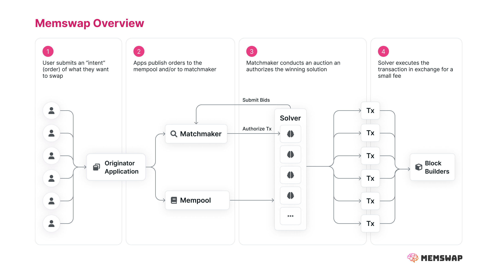

## Introduction

Memswap is an EVM protocol for trading tokens and NFTs using decentralized market orders. The protocol uses **intents** and **order flow auctions (OFAs)** to provide best-in-class execution.

Memswap aims to help users and applications leverage the MEV supply chain to improve swap execution. Memswap is not just MEV-resistant, it’s **_MEV-optimized_**. MEV searchers compete as Memswap solvers, incentivized to extract value _for_ users, rather than _from_ them. Instead of permissioned pools, the protocol uses a fully open and permissionless market of solvers to find the best prices possible for users. Block builders are leveraged to provide privacy, reduce failed transactions, and conduct auctions on behalf of users, thanks to their monopoly on building blocks.

Memswap is built on the core ideas of intents. To learn more about intents, check out - [Intent-based Swaps](/intent-based-swaps), where we give background on the idea and the potential UX benefits of this new trading paradigm.

<u>Memswap User Benefits</u>:

- Best-in-class price execution
- Limited centralization or enshrined actors
- Fast transaction execution (including single block execution)
- Privacy preserving features for high signal swaps
- A new level of NFT market composability

<u>Memswap Originator (Apps/Wallets) Benefits</u>:

- Simple integration UX
- Open-source, hostable matchmaker infrastructure (no undesired reliance on third parties)
- Flexible originator fees (%, % of surplus, etc)

To make these benefits possible, Memswap makes **core contributions** in four key areas:

[Mempool Order Distribution](/onchain-order-distribution): Memswap uses the Ethereum mempool for order distribution leveraging a novel mechanic called _intentful transactions_. Where offchain orders lead to improved UX, users may opt-in to centralized orderbooks.

[Order Flow Auctions (OFAs)](/order-flow-auctions): Memswap is built to be open and modular in order to support different order flow auction designs, such a matchmaker (last block) auctions and builder auctions. Applications may run their own matchmakers or choose to work with reputable actors.

[High Signal Privacy](/privacy): While public intents are less susceptible to MEV, high signal intents may still leak value. Memswap builds upon MEV-share’s “programmable privacy” for partial order concealment, as well as enabling complete privacy through direct routing to solvers.

[NFT Composability](/nft-composability): NFT liquidity is increasingly fragmented and restricted at the marketplace level (Blur) or the NFT standard (ERC721C). Memswap unlocks composability for such liquidity by shifting complexity to professional solvers.

