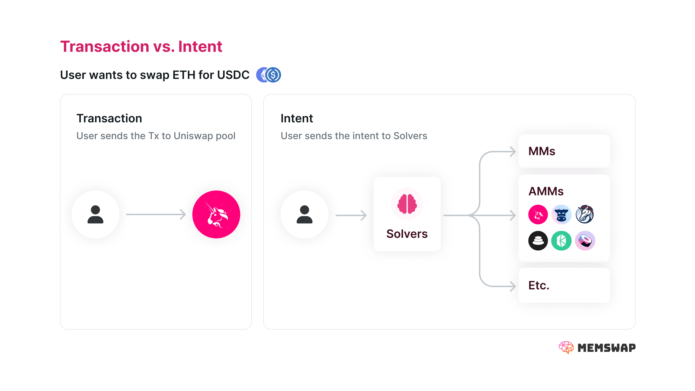

## Intent-based Swaps

Recently several swap protocols have been developed based on the core premise of _intents_. Intents are a general architecture for user expression, but have key benefits in the context of token and NFT trading.

### What are Intents?

Intents allows users to express desirable outcomes without the need to specify specific transactional routes. For swaps, instead of submitting a transaction to the blockchain to swap Eth for USDC using a specific Uniswap pool, an intent allows a user to signal they want to swap Eth for USDC in _any_ way, as long as the result meets conditions of the order, such as a minimum price.

→ [learn more about intent-based architecture and their risks](https://www.paradigm.xyz/2023/06/intents)

### Swap Intents

Intents enable a new paradigm for token and NFT trading. Rather than a swapper submitting a transaction to buy a specific token from a specific Uniswap pool, the swapper submits an intent (or order) describing the desired outcome - in this case, swapping token X and in return getting the maximum amount of Y possible. The intent can be fullfilled by **solvers** whose business it is to search for the most profitable routes possible. In an ideal world, the relationship between the swapper and the solver is that the solver provides the most profitable route for the swap (including any MEV) in exchange for a fee for their service. In practice, while intents protocols promise significant user benefits, they unveil a new set of design challenges and tradeoffs.

### Why are Intents Useful?

Intents are a useful paradigm for [a variety of different situations](https://brinktrade.medium.com/powerful-intents-part-1-7f97cc6425b3). For swaps, there are some key advantages:

##### MEV Reduction

Practically, users want their swaps to happen quickly and at a good price, but delivering this isn’t simple because of the [MEV supply chain](https://flashbots.mirror.xyz/bqCakwfQZkMsq63b50vib-nibo5eKai0QuK7m-Dsxpo). From the moment a user thinks about swapping tokens to the point a transaction is landed onchain, a myriad of actors compete to extract value from the user’s intent.

Recent innovations, such as [builder proposer separation (PBS)](https://boost.flashbots.net/), [MEV-share](/https://docs.flashbots.net/flashbots-protect/mev-share), and many intent-based protocols like [CowSwap](https://cow.fi/) and [UniswapX](https://uniswap.org/whitepaper-uniswapx.pdf), seek to improve execution by creating competitive MEV markets. Why is competition so important? Competition allows swappers to get better execution by having other actors compete for the right to fill their orders. You can learn more about “good” MEV markets, and the challenges of exclusive order flow (EOF) [here](https://writings.flashbots.net/order-flow-auctions-and-centralisation). Intents allow for significant MEV reduction for two major reasons:

1. More Efficient Markets

Since transaction routes are unknown, order flow auctions can be held publicly (at least in many circumstances). This allows more searchers to participate in auctions, improving market efficiency. The reason public auctions are appropriate is that the lack of transactional route prevents (or at least minimizes) front running, since searchers are not clear on which route will be taken. When orders have significant signal to move the market, making front running lucrative without a known route, users should leverage privacy preserving modes for order distribution, discussed [here](/privacy).

2. Decentralized Aggregation (discussed below)

##### Decentralized Aggregation

Since intents do not prescribe specific transactional routes, solvers can provide the best possible transaction path. To do this, solvers become accustomed to both offchain and onchain sources of liquidity and present these routes to users. This is a form of decentralized aggregation because different solvers need only understand some liquidity sources, and user will get routes that are best for their specific swapping needs. Optimal routing prevents backruns, capturing MEV for the user. Arguably, using intents in this way prevents MEV in the first place through optimal routing. We discuss decentralized aggregation further here.

This is a third evolution in trade execution:

**Direct → Trade with a single exchange**

The first dominate trading paradigm was to trade against a single exchange, such as a uniswap pool. In this world, MEV extraction is common since swap orders are likely to move a single pool significantly out of balance with the market price, among other reasons (i.e. sandwiches).

**Aggregation → Use a single “mega solver” to get the best rate across many exchanges**

Aggregators improve price execution by providing a variety of exchanges to fill swaps. Moreover, sophisticated aggregators may route a single order to many exchanges to improve price execution. Such a paradigm advances mega-aggregators, protocols that have access to the most profitable routes.

**Intents → Get your swap filled by across any exchange by any solver**

Intents are a third generation of swapping UX, where swappers can get their orders filled across many exchanges, by many solvers. The result is “decentralized aggregation”, where the sum of the solvers liquidity networks is greater than any one “mega-solver” may be able to produce itself. This is a new paradigm for optimal routing, MEV reduction, and improved pricing for users.

##### UX Improvements

Intents also enable a myriad of other UX improvements that are unavailable to direct transaction routing:

- Avoid failed transactions
- Fast tx propagation
- Better Composability
- Cross-chain purchasing
