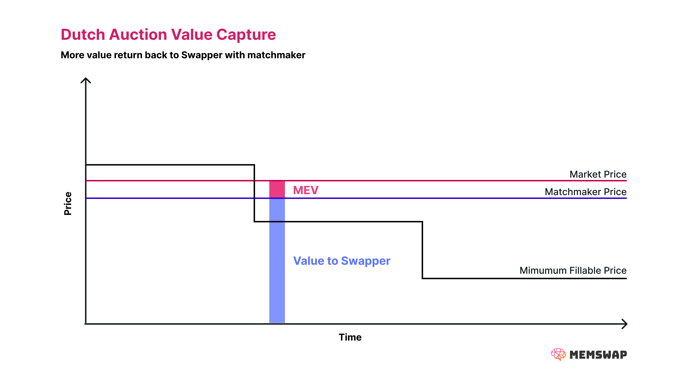

## Matchmaker Auction

Memswap uses Order Flow Auctions (OFAS) to capture surplus for users above the base price of their order, improve execution execution and speed. Before we discuss matchmakers, let's touch on how auctions can be used to capture surplus.

### Capturing Surplus

The Memswap protocol auction uses a dutch auction order format to improve prices for swappers. This works because as the price decays, solvers compete to fill the order given the current block’s order price. While this leads to substantive [UX improvements](/order-flow-auctions/protocol-auction) over traditional decentralized swaps, there are challenges still in achieving **best execution**. In practice, any excess value above a swapper’s minimum current block auction price will be captured by other users in the MEV supply chain (likely validators), and setting auction parameters to maximize value can lead to long time delays in getting orders filled.

_What can be done to improve the outcomes for swappers, both in time and value?_ For users looking for the best possible prices in a single block (or just a short time), Memswap offers an alternative - **shift the monopoly of choosing which solutions are valid to someone with the users’ best interests in mind**.

This actor can then conduct an explicit OFA to determine which solution is best for the user. Consider this:

1.  Alice wishes to swap ETH for USDC and creates a dutch auction decaying over blocks
2.  At block _t_, her order price is 1809 USDC, but the market price is 1830 USDC
3.  Solvers compete to provide the best possible outcome for Alice, each submitting their bid to a monopolist with the authority to authorize transactions
4.  The monopolist conducts an OFA and determines that the best price Alice can get is 1828 USDC, then authorizes that solver to fill the intent
5.  Alice captures 19 USDC **in surplus**

### Auction Design

The idea of a monopolist isn’t new. UniswapX, 1inch Fusion, the CoWSwap driver, and the MEV-share Node all use a model where monopolists are used to improve execution. We call this monopolistic actor a _Matchmaker_. Given the current state of transaction building and execution, trusted actors must be relied upon for matchmaking. In the future, the role of the matchmaker may be decentralized.

There are many approaches that may be taken to matchmaking. It is for this very reason that Memswap is designed to be open and not enshrine any particular matchmaker. There are significant choices to make both about matchmaker architecture and auction mechanics, in particular the choice between permissioned and permissionless architectures.

**Permissioned Auctions**

Permissioned designs like UniSwapX request-for-quote (RFQ) and CoWSwap rely on a central matchmaker and a permissioned pool of solvers. Permissioned pools of solvers allow matchmakers to trust solvers and bypass route simulation. The key benefit of permissioned auctions is that solvers must uphold reputation and as a result it is easy to prevent griefing when a specific solver is given exclusive rights. However, permissioned pools do not benefit from the economies of scale of true open competition, as only those with permission can provide routes. While permissioned solvers have a reputation to uphold, it can be challenging to identify if solvers act out of band. When orders are released to a permissioned pool, they are not truly private. Permissioned pools leak enough information that your signal can be extracted, because extraction cannot be properly attributed.

**Permissionless Auctions**

Alternatively, auctions can be designed to be permissionless using transaction simulation. The key benefits of permissionless auctions is that they allow that largest possible network of solvers to participate, increasing the likelihood of a solver finding an optimal route for the user. The problems with solvers using signal to extract user value persists, but are better solved by [ private orders](/privacy). While challenges with simulation exist, they can be overcome, especially when builders can be leveraged to determine transaction validity while building blocks.

### Current Matchmaker Design

Memswap is designed to allow any type of matchmaker to be built. However, the reference [Reservoir matchmaker](/matchmakers/matchmaker-v1) uses simulation to enable a permissionless solver network in order to access the largest number of solvers possible. Currently, the matchmaker conducts an OFA on behalf of users (Matchmaker Auction), though V2 of the matchmaker will facilitate an implicit Builder Auction.

The current design of Memswap uses a **_Last Block Auction_** design. This model:

- Allows any solver to submit proposed solutions
- The Matchmaker simulates all proposed solutions for validity against the _most recently landed block_
- Matchmaker conducts an order flow auction (OFA) on valid solutions
- The winning fillers receive exclusive rights to fill these orders in the next block

### Challenges with Last Block Auctions

One significant challenge of last block auctions is that the best outcome cannot be chosen by the matchmaker deterministically. Consider for instance a case where two solutions are provided for Alice, like the following:

- Solution A: 1 Eth for 1860 USDC with a maximum of 2% slippage
- Solution B: 1 Eth for 1858 USDC with zero slippage

In this case, there is no way to determine which solution is better without understanding all the transactions that will go into the next block. If Solution A doesn’t slip at all, then it is preferred. If is slips 2%, then it is worse than solution B. There are other similar scenarios like the one above, all related to a lack of understanding of all the order flow in the next proposed bloick.

The current design contends with this problem by releasing several solutions near the best price. This minor flaw is the reason that the prospective design for Memswap auctions is to use a builder auction, where order flow auctions can be conducted against the block that is currently being built.

Learn more about [Builder Auctions](/order-flow-auctions/builder-auctions).
