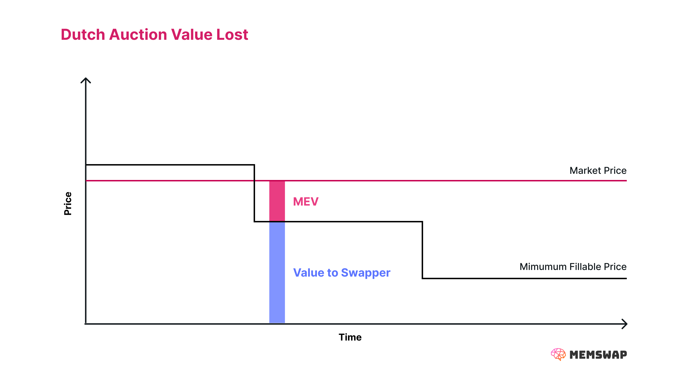

## Memswap Protocol Auction

In Memswap, the core order format is a Dutch auction. As the price decays, solvers gain access to fill the intent at a sequentially lower price. This is a forcing function to get solvers to fill at the best possible rate.

This mechanic is similar to UniswapX, 1Inch Fusion, and others, and is commonly referred to as a _price escalator_. You can think of this as a **protocol-mediated auction**, where as blocks progress the minimum filling price decreases. For permissionless orders, auctions much decrease over blocks.

To explore this further, we walk through an exemplary Memswap:

1. Alice wishes to swap 1 ETH for USDC using Memswap. Alice submits a transaction transferring 1 Eth with the intent to get a maximum quantity of USDC with a lower bound of 1791, with a 0.5% decay over two blocks.
2. In block _t_, Alice’s intent can only be fulfilled if a solver can provide 1809 USDC to Alice. No such route exists.
3. In block _t + 1_, Alice’s intent can only be fulfilled if the route can provide 1800 USDC to Alice. A searcher finds a route to fulfill this intent, and submits the bundle to a block builder. Regardless of the market price at _t+1_, Alice receives 1800 USDC for her 1 Eth. Any surplus is extracted by the MEV supply chain.

### Core Benefits

The Memswap Protocol Auction greatly improve execution over traditional transactions with onchain pools:

- **Decentralized Aggregation**: Solvers route orders to any onchain or offchain liquidity of which they are aware. As solvers may specialize in certain token pairs or types of liquidity, the net result is aggregation through a decentralized solver network.
- **Optimal Routing**: Not only does a solver network allow users to access many different onchain liquidity sources, but solvers can provide optimal routing across the various protocols. This mitigates (or at least reduces) the potential for backruns.
- **MEV Protection**: The lack of known route prior to the transaction bundle landing onchain, means adversarial MEV searchers are limited in their ability to frontrun transactions.
- **Offchain liquidity**: Solvers also may leverage offchain liquidity, improving execution.

### Core Limitations

While a Dutch auction is great at minimizing MEV, it isn’t perfect. Since it only sets the price per block, the price decreases as a step function. If the market price is above the auction price, solvers will capture this surplus for themselves. If multiple solvers are competing, then a second “intra-block” auction takes place as they bribe the builder to get their bundle included. [A lot can happen over the course of a block](https://twitter.com/0x81B/status/1679523684837625856?s=20), and by default the user won’t benefit from it. While setting auction parameters well can help here, it can also lead to an increase in the time it takes to get a swap filled.

It is safe to assume that all the excess value above a swapper’s minimum current block auction price will be captured by other actors in the MEV supply chain (likely validators). This is because anyone that can fill the intent above the current block price is in competition to do so. As a result, the excess value must be used farther along the MEV supply chain to win the tx. However, there is a way to capture this surplus.

Learn more about how Memswap [Captures Surplus](/order-flow-auctions/matchmaker-auctions).
