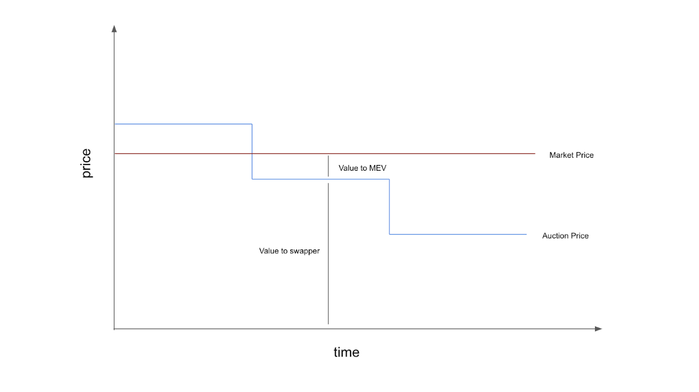

## **The MemSwap Core**

The MemSwap core is a **fully decentralized market order protocol** that leverages dutch auctions and the Ethereum Mempool for order distribution. The core allows users to make fully decentralized market order swaps, without the use of any third parties.

### Core Architecture

The memswap core introduces a key innovation - intentful transactions, a novel mechanic for distributing orders (intents) using the Ethereum Mempool. An intentful transaction is a transaction that embeds a user's intent. Practically, a user, expecting an intent to be fulfilled (as is the case with market orders), may embed the conditions of their intent inside a transaction’s calldata. More details on intentful transactions can be found here. The key benefit of this mechanic is that the public Ethereum Mempool can be used as the orderbook. We call this MemBook.

In the case of MemSwap, orders are embedded into approval transactions for the tokens required in the swap (or transfers for Eth swaps). Solvers may then parse intents from the ethereum mempool and submit bundles to block builders or matchmakers once they can fulfill the conditions of the intent. While memswap uses a specific order format for swaps, intentful transactions could be used for a variety of intent types. Swap orders in memswap are dutch auctions, similar to uniswapX and conform to the EIP-712 order standard.

#### Why dutch auctions?

The goal of having an auction mechanic is that, as the price decays, solvers gain access to fill the intent at a sequentially lower price. This is a forcing function to get solvers to fill at the best possible price. The auction price must decay as a function of blocks. To explore this further we walk through an exemplary MemSwap:

Alice wishes to swap 1 Eth for USDC using MemSwap. Alice submits a transaction transferring 1Eth to MemSwap with the intent to get a maximum quantity of USDC with a lower bound of 1791, with a 0.5% decay over two blocks.

In block t, Alice’s intent can only be fulfilled if a solver can provide 1809 USDC to Alice. No such route exists.

In block t + 1, Alice’s intent can only be fulfilled if the route can provide 1800 USDC to Alice. A searcher finds a route to fulfill this intent, and submits the bundle to a block builder. Regardless of the market price at t+1, Alice receives 1800 USDC for her 1 Eth. Any surplus is extracted by the MEV supply chain.

### Core Use Cases

With a fully decentralized market order protocol, a key question is when is this sufficient to lead to best execution? First, it is of course sufficient when the swapper prioritizes decentralization philosophically. While there are users that have this stance, we believe it is more important to justify this mode in practical terms.

The MemSwap Core leads to best execution when the user (or an aligned party) can effectively estimate the net value of the swap (value - 𝔼(cost of inclusion) ). Were you to know exactly how much value is in an order, it is simple to extract all that value for the user. One must simply set the starting order fulfillment price at v-E(c) and the user will get filled only at the best price, in the first block. In practice, this is nearly impossible and arguably the reason the user needs a decentralized network of solvers to begin with. However, the closer the user can get to knowing this value, the better. When the user prices above this point, the order won’t get filled. Below, she loses value. This speaks mostly to the optimal auction conditions for MemSwap orders. Parameterizing orders precisely means users can leave the minimum amount of value on the table while avoiding the use of trusted third party.

The MemSwap core is also effective for users that are less concerned with execution time. For users that care little about immediate execution, longer auctions can improve execution. On other EVM chains with shorter block times, longer auctions (in blocks) are less of a UX burden. More details of the time vs. value tradeoff are discussed here.

### Core Limitations

As a result of the challenges in setting perfect order constraints and block time decays, it is reasonable to assume that in many cases some value will be lost in the course of using the MemSwap core (though this can be minimized by setting precise order conditions). For a user that wants an order assuredly filled in the first block, she will surely leave some value on the table. When this happens, the surplus will likely be used in a bidding war between solvers to get their bundle landed on the block. Note that here “value” includes both transactional value that can be achieved through smart routing and signal value.

In order to capture value above the auction price, MemSwap introduces Matchmakers.
