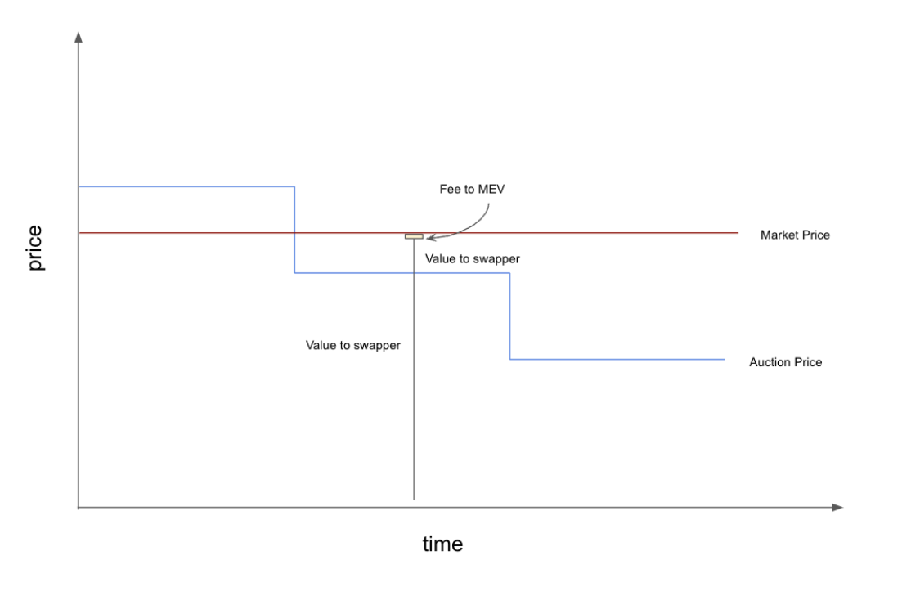

While a dutch auction is great at minimizing MEV, it isn’t perfect. It can only set the price per block, which means the price decreases as a step function. If the market price is above the auction price, solvers will capture this surplus for themselves. If multiple solvers are competing, then a second “intra-block” auction takes place as they bribe the validator to get their bundle included. A lot can happen over the course of a block, and by default the user won’t benefit from it. It is safe to assume that all the excess value above a swapper’s minimum current block auction price will be captured by other users in the MEV supply chain (likely validators). This is because anyone that can fill the intent above the current block price is in competition to do so. As a result, the excess value must be used farther along the MEV supply chain to win.

So what can be done to improve the outcomes for swappers, both in time and value? For users looking for the best possible prices in a single block (or just a short time), MemSwap enables an alternative - shift the monopoly of choosing which bundle is included to someone with the users’ best interests in mind. We call this actor a Matchmaker. The Matchmaker may be a trusted third party, or run by the swapping application itself. Matchmakers allow for better price execution, including near up to block confirmation improvements in price that occur due to interblock movement.
MemSwap is specifically designed to not have an enshrined matchmaker, but instead promote a decentralized network of matchmakers that may have different designs, be application specific, and earn trust as cooperative agents, similar to how builders earn trust in the builder environment. It’s true that this requires some centralization (for now), but having a network of matchmakers is a substantive step towards a world of decentralization, and one where incentives may prevent griefing.

### How does a matchmaker capture excess value for the swapper?

When a user elects to use a matchmaker, she signs an order that requires the matchmaker’s signature for execution. These orders are propagated using the public mempool, just as in the MemSwap Core. Solvers parse the orders, but rather than submitting the orders directly to builders, they must submit a signed solution to the matchmaker. The matchmaker then approves bundles that return the best execution to the swapper. Again, what do we mean by “best”? This is a complicated question. One that we discuss in further detail below, and believe is aided by a matchmaker network that can take a pluralistic approach to optimizing for a wide variety of users.

You can learn more about the technical details of Matchmaking, and check out Reservoir’s reference matchmaker implementation, here.

### What is best execution (again)?

When a user elects a matchmaker that has the best interest of the user in mind, that matchmaker must decide explicitly what it means by “best interest”. As we have discussed above, it need not just be the best price. Additionally, matchmakers are not simply considering the interest of a single user, but rather of many users together. This has the potential to lead to increased value for users through matching of orders in the same block or allocating value across users in an optimal way (such as uniform clearing prices). The key innovation here is that matchmakers may innovate and compete for order flow.

It’s true that some of the concerns around exclusive order flow to builders exist here. But there are some key differences:
Matchmakers don’t land blocks, so centralization is less concerning.

MemSwap has built in explicit mechanics for order flow originators to earn outside of EOF, reducing the incentive for private payment for order flow (PFOF).

Building a network of decentralized actors with varying objective functions is highly aligned with the future world of decentralized block building.

Best execution depends on the underlying swappers’ utility. Take CoWswap for instance. The protocol uses a linear utility function (and as a result uniform clearing prices), as a primitive. We believe this to be a reasonable assumption, but just one of many. The important acknowledgement is that “best” execution, especially when considering many orders from many swappers, is a normative claim. Which is why a decentralized network of matchmakers is critical for users and applications to maximize utility.

### A many matchmaker world

Why would a variety of matchmakers exist?

Matchmaking is a complex job, requiring strong technical capabilities and investment. Incentives to matchmake will prompt teams to develop more capable matchmakers that solve batches of orders to improve user outcomes, for example by leveraging COWs.

Matchmakers may experiment with different auction types, as MemSwap opens up the design space for different types of auctions all to be facilitated by the same protocol.

Applications may choose to run matchmakers to reduce dependency on trusted third parties.

You can learn more about the technical details of Matchmaking, and check out Reservoir’s reference matchmaker implementation, here.
