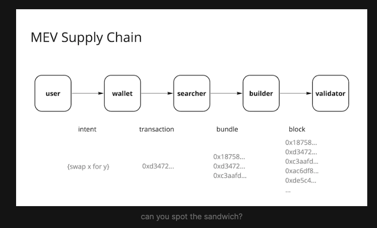
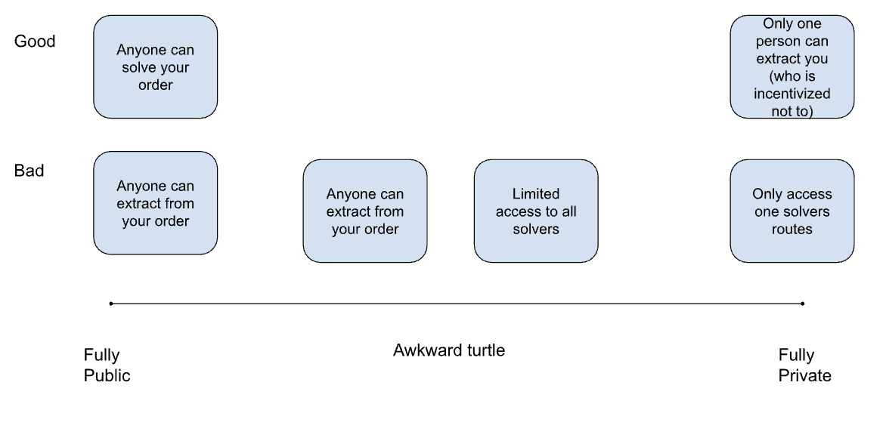

# Why MemSwap?

The core mandate of swap protocols is to provide users with the best possible execution for their swaps. What this means exactly is complicated, but like Marcus describes, “best execution” involves understanding speed, price, and privacy. Practically, users want their swaps to happen quickly and at a good price. Providing users with the best execution isn’t simple because of the MEV supply chain. In practice, from the moment a user thinks about swapping tokens to the point a transaction is landed onchain, a myriad of actors compete to extract value from the user’s intent.

Applications want to provide users with the best swaps, but to do so, it’s important to consider both the short and a long term view of this problem.

`We want to improve execution for users today, in a way that enables or builds towards a world with limited trust requirements - where MEV is captured by swappers by design, not by agreement.`

There are two key considerations here:

- How might we mitigate MEV externalities through execution improvements for swappers?
- How might we do so by design (i.e. through decentralization)?

To be more explicit, let’s talk about what good MEV markets look like.

### What good MEV markets look like

At its core, a good MEV market has competition. In this sense decentralization is good philosophically, as well as practically. Why is competition so important? Competition prevents rent-seeking, and allows swappers to have leverage to internalize the value of their orders. Healthy competition is also by definition non-centralizing, since many actors are needed to compete. In this way competition reduces larger, long term centralization risks that are often associated with exclusive order flow (EOF).

In a perfect world (one with competitive markets), swappers would be able to extract the total value of their order (the maximum amount achievable from the swap) minus the cost of landing the transaction onchain:

`value - 𝔼(cost of inclusion)`

Why is achieving this state hard? For two reasons:

- Markets are adversarial, so actors are keen to extract available value.

- The information landscape is asymmetric. Swappers (who are often retail users) do not have a proper gauge on the value of their order.

You can learn more about “good” MEV markets, and the challenges of exclusive order flow (EOF) here.

### How to build “best execution”

In light of these goals, a variety of solutions have been proposed to improve execution for swappers, including UniswapX, 1inch Fusion, DFlow, CoWSwap and more. Each takes a different stance on the tradeoffs between privacy vs. publicness and centralization vs. best execution.

In reality, the best solution for your swap depends critically on the type of trade you are making. In particular, it matters whether you are making a transactional trade or a signal trade. This classification corresponds well to user’s preferences around price, speed, and privacy. Transactional trades are trades that retail users make that have limited to no price signal (think rebalancing a portfolio, or swapping Eth to USDC to pay a worker). Transactional trades benefit from public auctions. For high signal trades, swappers benefit from privacy. Because once signal is public, actors will race to extract the signal as quickly as possible.

A quick heuristic might be:

- Decentralized (highly competitive) where possible
- Trust where the benefits outweigh the costs
- Private where necessary

Because the details matter, we discuss each of these tradeoffs in more detail below. You can read more about transactional and signal trades here.

### Tradeoffs between publicness and privacy

Before we condemn public orders, let's remember what Quitus from Flashbots has said: “It need not be that the public mempool is where you get eaten alive”. In fact there are a variety of conditions where public orders are preferred, even in terms of price.

Public orders are good when you want access to the largest set of solvers to get the best price and you want assurances that your orders are filled in a reasonable amount of time (given their conditions). Let’s say you have a low signal trade, and you want the best price. The ideal outcome is to have the largest network of solvers search for the best route on your behalf as long as you can capture the value of your order. It is important to note that orders (with no specified route) are harder to extract from than transactions with specified routes, complicating and likely decreasing the ability of MEV extraction against users of public pools.

Where public orders fail is when there is a significant signal in the order. When signal trades become public, the signal will often be extracted by the MEV supply chain, before a user has the ability to land a tx onchain. Searchers will even use approvals as a trade signal. Since you don’t want to leak information about your order, and so having a private order is preferred.

One issue with many of the new OFA protocols like CowSwap and UniswapX is that they fall in an awkward middle ground of not being public or truly private. Permissioned pools leak enough information that your signal can be extracted, because extraction cannot be properly attributed. At the same time, permissioned pools do not benefit from the economies of scale of true open competition that allows each individual solver to specialize in specific routes and provide value to users in a subset of circumstances. Batch auctions present a related issue by requiring solvers to provide a solution to the entire batch, tipping the scales towards megasolvers.

### Tradeoffs between decentralization and best execution

The long term vision here is to not require centralization for improved execution. There are many teams working towards this vision including Flashbots (SUAVE), Anoma, Eigenlayer, and more. But today, there are certain concessions that must be made in order for the best execution. Where centralization is necessary, we believe it is important to not build enshrined actors, but open networks of agents that can earn reputation and compete for order flow, similar to the block building landscape today.
